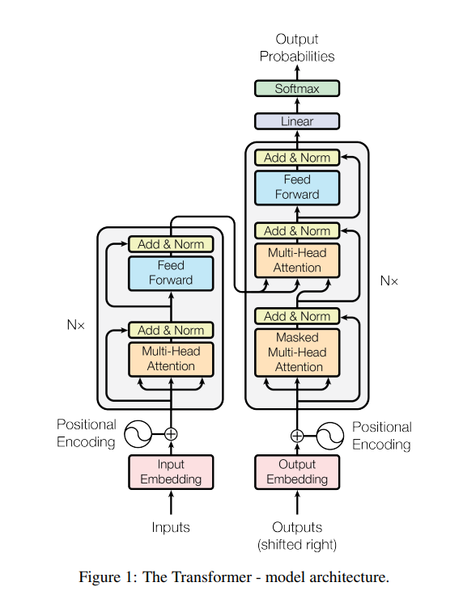

# Transformers

English | [简体中文](./index_zh-CN.md)

Transformer is a deep learning architecture that employs attention mechanisms, which can assign different weights according to the importance of different parts of the input data. It is mainly used for processing sequential input data, making it suitable for natural language processing. Now let's dive deep into the various components of this architecture.

The above diagram comes from the paper "Attention is All You Need" published by Google Research in 2017. The left half is an encoder for processing input data, and the right half is a decoder for processing output data. Together, they compute the probability distribution of the output content.

Each input data is first processed into a vector space that the model can understand, a step called Embedding. For example, a token is computed as a 512-dimensional vector space. Then through Positional Encoding, the positional information of this data in the entire input is also encoded into this vector space. The same two-step processing is applied to the output data.

First, let's talk about what single-head attention is: The processed 512-dimensional vector space is multiplied by three 512x512 weight matrices, Wq, Wk, Wv, to obtain three vectors Q (Query): representation of what information the current position wants to find, K (Key): representation of what information each position can provide, V (Value): the actual information content contained at each position. Then we compute attention through these Q, K, V using the formula: `Attention(Q, K, V) = softmax(QK^T/√d_k)V`, where d_k represents the dimension. Taking "I love drinking water" as an example, when processing the word "drinking": Q (query for "drinking"): represents what information "drinking" wants to focus on, such as "I need to find objects related to the action", K (keys for all positions): the type of information each word provides, such as "I" provides subject information, "water" provides object information, V (values for all positions): the actual semantic content of each word. By computing the similarity between "drinking"'s Q and all words' K, the model finds that "water"'s K best matches "drinking"'s Q, thus assigning higher attention weight to "water"'s V, allowing "drinking" to focus more on the object information "water".

"Attention is All You Need" innovatively provides multi-head attention, which is the Multi-Head Attention shown in the diagram. The main difference from single-head is that the processed 512-dimensional input vector space is multiplied by 8 groups of three 512×64 weight matrices, then after attention computation, 8 groups of 64-dimensional vector spaces are obtained, concatenated and passed through a linear layer to finally output a 512-dimensional vector. This provides rich semantic computation without increasing computational cost.

Then this vector undergoes residual computation and normalization with the input vector space to avoid losing too much input information after attention computation. Finally, it passes through a feed-forward network once more to form one attention layer. Through multiple attention layers, we can obtain an encoder.

Now back to the decoder. Our goal is to train the model to predict output, then compare the predicted output with the training target output to see if it's accurate. If not accurate, we adjust the model's weights until the model's predicted output loss is relatively small. The decoder processes the target output by first performing Masked Multi-Head Attention, which applies masking to the target output so the model won't cheat by seeing the target output. Then the output vector is multiplied by the next attention computation's Wq to compute Query, while using the encoder's processed input multiplied by Wk, Wv to obtain Key and Value. Next comes residual computation, normalization, and feed-forward network computation to get the output. This process also goes through N layers. After multiple layers of attention computation, we already have the predicted result, but we need to convert it into a usable output format. So first we pass it through a mapping to convert it into a distribution over all outputs, then through Softmax to convert it into a probability table. Finally, we take the output with the highest probability as the result.

Compared to traditional neural networks like RNN and CNN, the total computational complexity per layer is reduced. The key advantage over RNNs is that this mechanism allows parallel computation, greatly reducing computation time for large amounts of input, and improves the model's ability to learn long-range dependencies.