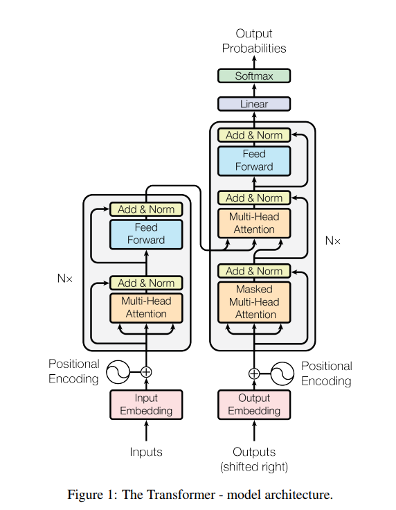

# Transformer

[English](./index.md) | 简体中文

Transformer是一种采用注意力机制的深度学习架构，这一机制可以按输入数据各部分重要性的不同而分配不同的权重，主要用于处理顺序输入数据，所以可以用于自然语言处理。现在我们来深入了解一下该架构的各个部分。

上图来自于2017年Google Research发表的论文Attention is all you need，左半部分是一个编码器，用于处理输入数据，右半部分是一个解码器，用于处理输出数据，两者共同计算可以得出输出内容的概率分布。

每一个输入数据首先会被处理成模型能理解的向量空间，这一步叫Embedding, 比如将一个token计算为一个有512维度的向量空间。然后通过一步Positional Encoding将该数据在整个输入中的位置信息也编码到这个向量空间中。同样的输出数据也会进行这两步处理。

首先讲讲什么是单头注意力：经过处理的512维的向量空间，会被分别乘以三个512x512的权重，Wq, Wk, Wv，然后得到的三个向量Q (Query): 当前位置想要查找什么信息的表示，K (Key): 每个位置可以提供什么信息的表示，V (Value): 每个位置实际包含的信息内容, 然后我们通过这个Q，K，V来计算注意力，公式：`Attention(Q, K, V) = softmax(QK^T/√d_k)V`，其中d_k表示维度。以"我爱喝水"为例，当处理"喝"这个词时：Q ("喝"的查询)：表示"喝"想要关注什么信息，比如"我需要找到与动作相关的对象"，K (所有位置的键)：每个词提供的信息类型，如"我"提供主语信息，"水"提供宾语信息，V (所有位置的值)：每个词的实际语义内容，通过计算"喝"的Q与所有词的K的相似度，模型发现"水"的K与"喝"的Q最匹配，因此给"水"的V分配更高的注意力权重，让"喝"能够更多地关注到"水"这个宾语信息。

Attention is all you need创新性的提供的多头注意力，也就是图中的Multi-Head Attention，和单头的主要区别是经过处理的512维的输入向量空间，会被分别乘以8组三个512乘以64的权重，然后经过注意力计算得到8组维度为64的向量空间，拼接后通过线形层最终输出一个512维的向量。这个样即提供了丰富的语义计算，又没有增加计算量。

然后这个向量会和输入向量空间做一个残差计算和归一化计算，为的是避免输入信息在经过注意力计算后损失太多。最后再经过前向网络在计算一次即为一个注意力层。我们通过多层注意力即可得到一个编码器。

再回到解码器。我们的目的是训练模型预测输出，然后将预测的输出和训练的目标输出做比较，看是否准确，如果不准确则调整模型的权重，直至模型预测的输出损失比较小。那么解码器便是将目标输出做处理，首先进行Masked-Multi-Head Attention，即对目标输出做掩码计算，这样模型就不会看到目标输出而作弊计算，然后将输出的向量乘以下一个注意力计算的Wq来计算Query，而使用解码器计算过后的输入乘以Wk, Wv来获得Key和Value，接下来仍然是残差计算和归一化计算以及前向网络计算来获得输出，这个过程也会经过N层。经过多层注意力计算已经得到的是预测的结果了，但是我们要将其转化为可以使用的输出方式，所以首先要通过一个映射转化为所有输出的分布，然后再经过Softmax转化为概率表，最终我们取概率最高的输出为结果。

相比较于传统的RNN, CNN等神经网络，每层的计算总复杂度降低了，关键是相比于RNN，这种机制可以进行并行计算，大大缩短了对于大量输入的计算时间，并且提高了模型内部学习长距离依赖的能力。
